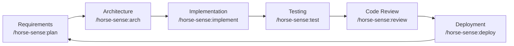

# horse-sense

> Mr. Ed's practical and powerful Claude Code plugin with agents, skills and rules.

**horse-sense** is a publicly available [Claude Code](https://claude.ai/code) plugin that guides autonomous software development through a structured SDLC methodology. It provides agents, skills, rules, templates, and bash scripts to help you ship software faster and more consistently.

---

## What It Does

| Capability | Description |
|---|---|
| **Agents** | Specialized role prompts: Planner, Architect, Developer, Tester, Reviewer |
| **Skills** | Step-by-step guides for every SDLC phase |
| **Rules** | Coding standards, documentation, testing, and git workflow rules |
| **Templates** | Fill-in-the-blank docs for project plans, requirements, architecture, and sprints |
| **Slash Commands** | Custom Claude commands to trigger SDLC workflows |
| **Scripts** | Bash scripts for environment setup, running tests, and linting |

---

## Quick Start

```bash
# 1. Clone the plugin
git clone https://github.com/edlovesjava/horse-sense

# 2. Use it with Claude Code
claude --plugin-dir ./horse-sense

# 3. Start the SDLC workflow
# /horse-sense:sdlc-start
```

---

## Plugin Structure

```
horse-sense/
├── .claude-plugin/
│   └── plugin.json              ← Plugin manifest
├── CLAUDE.md                    ← Main plugin instructions (Claude reads this)
├── commands/                    ← Custom slash commands
│   ├── sdlc-start.md           ← /horse-sense:sdlc-start
│   ├── plan.md                 ← /horse-sense:plan
│   ├── arch.md                 ← /horse-sense:arch
│   ├── implement.md            ← /horse-sense:implement
│   ├── review.md               ← /horse-sense:review
│   ├── test.md                 ← /horse-sense:test
│   ├── deploy.md               ← /horse-sense:deploy
│   ├── sprint.md               ← /horse-sense:sprint
│   └── retrospective.md        ← /horse-sense:retrospective
├── agents/
│   └── workers/                 ← Specialized role agents
│       ├── planner.md           ← Project planning agent
│       ├── architect.md         ← System design agent
│       ├── developer.md         ← Implementation agent
│       ├── tester.md            ← QA / test automation agent
│       └── reviewer.md          ← Code review agent
├── skills/
│   ├── python_venv/SKILL.md     ← Python virtual environment setup
│   ├── requirements_analysis/SKILL.md
│   ├── architecture_design/SKILL.md
│   ├── implementation/SKILL.md
│   ├── testing/SKILL.md
│   └── deployment/SKILL.md
├── rules/
│   ├── code_quality.md          ← Coding standards
│   ├── documentation.md         ← Documentation standards
│   ├── testing.md               ← Testing requirements
│   └── git_workflow.md          ← Branching and commit conventions
├── templates/
│   ├── project_plan.md          ← Project plan template
│   ├── requirements_doc.md      ← Requirements document template
│   ├── architecture_doc.md      ← Architecture document template
│   └── sprint_plan.md           ← Sprint plan template
├── scripts/
│   ├── setup_env.sh             ← Bootstrap Python venv
│   ├── run_tests.sh             ← Run tests with coverage
│   ├── lint.sh                  ← Run all linters
│   └── new_project.sh           ← Scaffold a new project
└── bin/                         ← Executables (added to PATH)
```

---

## Slash Commands

Use these in Claude Code to trigger structured workflows:

| Command | Description |
|---|---|
| `/horse-sense:sdlc-start` | Full SDLC kickoff: requirements → design → planning → implementation |
| `/horse-sense:plan` | Create or update project plan and sprint backlog |
| `/horse-sense:arch` | Design system architecture, generate diagrams and ADRs |
| `/horse-sense:implement` | Implement a user story with TDD workflow |
| `/horse-sense:review` | Code review against project standards |
| `/horse-sense:test` | Create and run tests with coverage reporting |
| `/horse-sense:deploy` | Deploy to staging or production with pre-flight checks |
| `/horse-sense:sprint` | Plan and manage a sprint |
| `/horse-sense:retrospective` | Facilitate a sprint retrospective |

---

## Agents

Switch context by referencing the relevant agent file:

```
Read agents/workers/architect.md and help me design the data model for my user management system.
```

| Agent | File | Best For |
|---|---|---|
| Planner | `agents/workers/planner.md` | Requirements, roadmaps, sprint planning |
| Architect | `agents/workers/architect.md` | System design, tech selection, ADRs |
| Developer | `agents/workers/developer.md` | Implementation, debugging, refactoring |
| Tester | `agents/workers/tester.md` | Test strategy, coverage, security scans |
| Reviewer | `agents/workers/reviewer.md` | Code review, security, performance |

---

## Scripts

```bash
# Bootstrap the Python venv
bash scripts/setup_env.sh

# Run all tests with coverage
bash scripts/run_tests.sh

# Run only unit tests
bash scripts/run_tests.sh --unit

# Lint and type-check (with auto-fix)
bash scripts/lint.sh --fix

# Scaffold a new project
bash scripts/new_project.sh my-api
```

---

## SDLC Workflow



---

## Prerequisites

- Python >= 3.11
- Git
- Bash-compatible shell (Linux / macOS / WSL)
- [Claude Code](https://claude.ai/code) with plugin support

---

## Contributing

1. Fork the repository
2. Create a branch: `git checkout -b feature/your-improvement`
3. Make your changes following the rules in `rules/`
4. Open a pull request with a clear description

---

## License

See [LICENSE](LICENSE).
