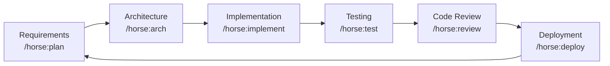

# horse-sense

> Mr. Ed's practical and powerful Claude Code plugin with agents, skills and rules.

**horse-sense** is a publicly available [Claude Code](https://claude.ai/code) plugin that guides autonomous software development through a structured SDLC methodology. It provides agents, skills, rules, templates, and bash scripts to help you ship software faster and more consistently.

---

## Quick Start

```bash
# 1. Clone the plugin
git clone https://github.com/edlovesjava/horse-sense

# 2. Use it with Claude Code
claude --plugin-dir ./horse-sense/horse

# 3. Start the SDLC workflow
# Type /horse:guide in Claude Code to begin
```

---

## What It Does

| Capability | Description |
|---|---|
| **Agents** | Specialized role prompts: Planner, Architect, Developer, Tester, Reviewer, Scout |
| **Skills** | Step-by-step guides for every SDLC phase (Python + TypeScript) |
| **Rules** | Coding standards, documentation, testing, and git workflow rules |
| **Templates** | Fill-in-the-blank docs for project plans, requirements, architecture, and sprints |
| **Slash Commands** | Custom Claude commands to trigger SDLC workflows |
| **Scripts** | Bash scripts for environment setup, testing, and linting (auto-detects language) |

---

## Configuration

The plugin uses two configuration layers:

### `horse.config.md` — SDLC workflow settings

Place in your project root. Controls how the plugin organizes your project:

| Setting | Values | Default |
|---|---|---|
| `requirements_format` | `monolith` / `per-story` | `monolith` |
| `requirements_stories_dir` | directory path | `docs/requirements/stories` |
| `git_strategy` | `rebase` / `merge` | `rebase` |

### `.claude/config.json` — Toolchain settings

Per-project toolchain configuration. Auto-detected from `pyproject.toml` (Python) or `package.json` (TypeScript) if absent.

| Setting | Python default | TypeScript default |
|---|---|---|
| `language` | `python` | `typescript` |
| `testRunner` | `pytest` | `vitest` |
| `linter` | `ruff check` | `eslint` |
| `typeChecker` | `mypy` | `tsc --noEmit` |
| `formatter` | `ruff format` | `prettier --write` |
| `srcDir` | `src` | `src` |
| `testDir` | `tests` | `tests` |
| `coverageThreshold` | `80` | `80` |

Full schema: [`horse/schemas/config.schema.json`](horse/schemas/config.schema.json)

Example configs: [`config.example.python.json`](horse/templates/config.example.python.json), [`config.example.typescript.json`](horse/templates/config.example.typescript.json)

---

## Slash Commands

| Command | Description |
|---|---|
| `/horse:guide` | Follow the SDLC trail: requirements, design, planning, implementation |
| `/horse:plan` | Create or update project plan and sprint backlog |
| `/horse:arch` | Design system architecture, generate diagrams and ADRs |
| `/horse:implement` | Implement a user story with TDD workflow |
| `/horse:review` | Code review against project standards |
| `/horse:test` | Create and run tests with coverage reporting |
| `/horse:deploy` | Deploy to staging or production with pre-flight checks |
| `/horse:sprint` | Plan and manage a sprint |
| `/horse:retrospective` | Facilitate a sprint retrospective |

---

## Agents

Agents are auto-discovered by the plugin manager:

| Agent | Best For |
|---|---|
| **planner** | Requirements, roadmaps, sprint planning |
| **architect** | System design, tech selection, ADRs |
| **developer** | Implementation, debugging, refactoring |
| **tester** | Test strategy, coverage, security scans |
| **reviewer** | Code review, security, performance |

---

## Skills

Skills provide step-by-step guidance that adapts to your project's language and toolchain:

| Skill | Description |
|---|---|
| `requirements-analysis` | Elicit, document, and validate requirements |
| `architecture-design` | Design systems, select technologies, create ADRs |
| `implementation` | TDD workflow with language-appropriate tooling |
| `testing` | Test pyramid strategy with coverage enforcement |
| `deployment` | Docker, CI/CD, runbooks, and rollback procedures |
| `python-venv` | Python virtual environment setup |
| `typescript-setup` | TypeScript/Node.js project setup |

---

## SDLC Workflow



---

## Plugin Structure

```
horse-sense/
├── horse/                           ← THE PLUGIN (--plugin-dir target)
│   ├── .claude-plugin/
│   │   └── plugin.json             ← Plugin manifest (name: "horse")
│   ├── commands/                    ← Slash commands (/horse:*) [auto-discovered]
│   ├── agents/                      ← Role agents [auto-discovered]
│   ├── skills/                      ← SKILL.md guides [auto-discovered]
│   ├── bin/                         ← Executables added to PATH [auto-discovered]
│   ├── schemas/                     ← JSON schemas (supporting files)
│   ├── rules/                       ← Coding standards (supporting files)
│   ├── templates/                   ← Document scaffolds (supporting files)
│   └── scripts/                     ← Shell automation (supporting files)
├── docs/                            ← Project documentation (not part of plugin)
├── CLAUDE.md
├── README.md
└── LICENSE
```

---

## Prerequisites

- **Python >= 3.11** (for Python projects) or **Node.js >= 20** (for TypeScript projects)
- Git
- Bash-compatible shell (Linux / macOS / WSL)
- [Claude Code](https://claude.ai/code) with plugin support

---

## Development

```bash
# Run all plugin checks (validation, linting, shellcheck)
make check

# Auto-fix markdown lint issues
make fix
```

---

## Contributing

1. Fork the repository
2. Create a branch: `git checkout -b feature/your-improvement`
3. Make your changes following the rules in `horse/rules/`
4. Run `make check` to validate
5. Open a pull request with a clear description

---

## License

See [LICENSE](LICENSE).
