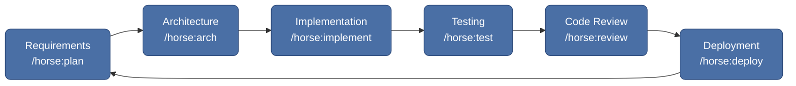
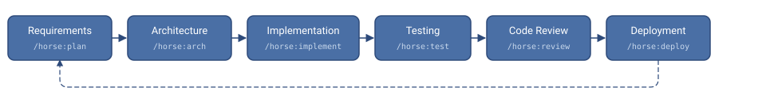

<div align="center">

# horse-sense

**Mr. Ed's practical and powerful Claude Code plugin for structured software development.**

[](LICENSE)
[](https://claude.ai/code)
[](horse/.claude-plugin/plugin.json)
[](https://github.com/edlovesjava/horse-sense/pulls)

*Agents, skills, and process orchestration for shipping high-quality software — faster.*

[Quick Start](#quick-start) · [Features](#features) · [Commands](#slash-commands) · [Agents](#agents) · [Configuration](#configuration) · [Contributing](#contributing)

</div>

---

## The Problem

Building software with AI assistants is powerful — but without structure, you get inconsistent output, skipped tests, missing docs, and drift from best practices. You need a copilot that follows a real development process, not just one that writes code.

## The Solution

**horse-sense** brings a full SDLC methodology to [Claude Code](https://claude.ai/code). It provides specialized agents, step-by-step skills, coding standards, and workflow automation — so every feature goes through requirements, design, implementation, testing, review, and deployment.

```
You: /horse:guide
Horse: Let's build this right. Starting with requirements...
```

---

## Quick Start

```bash
# 1. Clone the plugin
git clone https://github.com/edlovesjava/horse-sense.git

# 2. Launch Claude Code with the plugin
claude --plugin-dir ./horse-sense/horse

# 3. Start the guided SDLC workflow
/horse:guide
```

That's it. The guide will walk you through setting up your project configuration and kicking off the first sprint.

---

## Features

<table>
<tr>
<td width="50%">

### Agents

Specialized AI personas that think like your team:

- **Planner** — requirements, roadmaps, sprint planning
- **Architect** — system design, tech selection, ADRs
- **Developer** — implementation, debugging, refactoring
- **Tester** — test strategy, coverage, security scans
- **Reviewer** — code review, security, performance
- **Scout** — research spikes, technology evaluation
- **Trainer** — artifact quality auditing, process compliance

</td>
<td width="50%">

### Skills

Step-by-step guides that adapt to your language and toolchain:

- **Requirements Analysis** — elicit, document, validate
- **Architecture Design** — systems, ADRs, tech selection
- **Implementation** — TDD workflow with smart tooling
- **Testing** — test pyramid with coverage enforcement
- **Deployment** — Docker, CI/CD, runbooks, rollback
- **PR Review** — automated pull request analysis
- **Process Audit** — SDLC compliance checking

</td>
</tr>
<tr>
<td>

### Rules & Standards

Built-in coding standards so every commit is consistent:

- Code style and documentation rules
- Testing requirements and coverage thresholds
- Git workflow and commit conventions
- Security and performance guidelines

</td>
<td>

### Templates & Scripts

Ready-made scaffolds and automation:

- Project plans, requirements docs, architecture docs
- Sprint planning and retrospective templates
- Bash scripts for env setup, testing, linting
- Auto-detects Python and TypeScript toolchains

</td>
</tr>
</table>

---

## SDLC Workflow

The plugin guides you through a complete development cycle:

<!-- Mermaid renders natively on GitHub; the SVG fallback covers other viewers -->


<details>
<summary>Not seeing the diagram? Click here for the static version.</summary>

<p align="center">
  
</p>

</details>

Each phase has a dedicated slash command, a specialized agent, and a skill guide that walks you through it step by step.

---

## Slash Commands

| Command | What it does |
|---|---|
| `/horse:guide` | Full SDLC kickoff — walks you from zero to first sprint |
| `/horse:plan` | Create or update project plan and sprint backlog |
| `/horse:arch` | Design system architecture, generate diagrams and ADRs |
| `/horse:implement` | Implement a user story with TDD workflow |
| `/horse:test` | Create and run tests with coverage reporting |
| `/horse:review` | Code review against project standards |
| `/horse:deploy` | Deploy to staging or production with pre-flight checks |
| `/horse:sprint` | Plan and manage a sprint |
| `/horse:retrospective` | Facilitate a sprint retrospective |
| `/horse:audit` | Audit process trail and artifact quality |

---

## Agents

Agents are auto-discovered by the plugin manager and bring specialized perspectives to your work:

| Agent | Role | Best for |
|---|---|---|
| **planner** | Product Owner | Requirements, roadmaps, sprint planning |
| **architect** | Tech Lead | System design, tech selection, ADRs |
| **developer** | Senior Engineer | Implementation, debugging, refactoring |
| **tester** | QA Engineer | Test strategy, coverage, security scans |
| **reviewer** | Code Reviewer | Standards compliance, security, performance |
| **scout** | Researcher | Spikes, technology evaluation, codebase exploration |
| **trainer** | Process Coach | Artifact quality auditing, process trail compliance |

---

## Configuration

The plugin uses two configuration layers that adapt to your project.

<details>
<summary><strong>horse.config.md</strong> — SDLC workflow settings</summary>

Place in your project root. Controls how the plugin organizes your project:

| Setting | Values | Default | Description |
|---|---|---|---|
| `requirements_format` | `monolith` / `per-story` | `monolith` | How user stories are organized |
| `requirements_stories_dir` | directory path | `docs/requirements/stories` | Where per-story files live |
| `git_strategy` | `rebase` / `merge` | `rebase` | How feature branches are integrated |

</details>

<details>
<summary><strong>.claude/config.json</strong> — Toolchain settings</summary>

Per-project toolchain configuration. Auto-detected from `pyproject.toml` or `package.json` if absent.

| Setting | Python default | TypeScript default |
|---|---|---|
| `language` | `python` | `typescript` |
| `testRunner` | `pytest` | `vitest` |
| `linter` | `ruff check` | `eslint` |
| `typeChecker` | `mypy` | `tsc --noEmit` |
| `formatter` | `ruff format` | `prettier --write` |
| `srcDir` | `src` | `src` |
| `testDir` | `tests` | `tests` |
| `coverageThreshold` | `80` | `80` |

Full schema: [`horse/schemas/config.schema.json`](horse/schemas/config.schema.json) · Examples: [`Python`](horse/templates/config.example.python.json) · [`TypeScript`](horse/templates/config.example.typescript.json)

</details>

---

## Plugin Structure

```
horse-sense/
├── horse/                           The plugin (--plugin-dir target)
│   ├── .claude-plugin/
│   │   └── plugin.json             Plugin manifest
│   ├── commands/                    Slash commands (/horse:*)
│   ├── agents/                      Role agents
│   ├── skills/                      Step-by-step SKILL.md guides
│   ├── bin/                         Executables added to PATH
│   ├── schemas/                     JSON schemas
│   ├── rules/                       Coding standards
│   ├── templates/                   Document scaffolds
│   └── scripts/                     Shell automation
├── docs/                            Project documentation
├── CLAUDE.md                        Plugin development guide
├── README.md                        You are here
└── LICENSE                          Apache 2.0
```

---

## Philosophy

1. **Document first** — write requirements and design docs before code
2. **Small iterations** — short cycles with clear, testable outcomes
3. **Automate the repeatable** — scripts and templates for everything routine
4. **Test as you build** — no feature is done without tests
5. **Humans in the loop** — autonomous means assisted, not unattended

---

## Prerequisites

- [Claude Code](https://claude.ai/code) with plugin support
- **Python >= 3.11** or **Node.js >= 20** (depending on your project)
- Git
- Bash-compatible shell (Linux / macOS / WSL)

---

## Development

```bash
# Run all plugin checks (validation, linting, shellcheck)
make check

# Auto-fix markdown lint issues
make fix
```

---

## Contributing

Contributions are welcome! Here's how to get started:

1. **Fork** the repository
2. **Branch** from main: `git checkout -b feature/your-improvement`
3. **Follow** the coding standards in `horse/rules/`
4. **Validate** with `make check`
5. **Open a PR** with a clear description of what and why

See the [rules directory](horse/rules/) for coding standards and conventions.

---

<div align="center">

## License

[Apache License 2.0](LICENSE)

---

Made with horse sense by [Ed Wentworth](https://github.com/edlovesjava)

</div>
