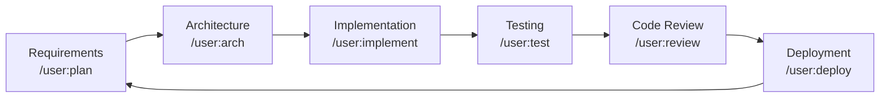

# horse-sense

> Mr. Ed's practical and powerful Claude Code plugin with agents, skills and rules.

**horse-sense** is a publicly available [Claude Code](https://claude.ai/code) plugin that guides autonomous software development through a structured SDLC methodology. It provides agents, skills, rules, templates, and bash scripts to help you ship software faster and more consistently.

---

## What It Does

| Capability | Description |
|---|---|
| 🤖 **Agents** | Specialized role prompts: Planner, Architect, Developer, Tester, Reviewer |
| 🛠️ **Skills** | Step-by-step guides for every SDLC phase |
| 📋 **Rules** | Coding standards, documentation, testing, and git workflow rules |
| 📄 **Templates** | Fill-in-the-blank docs for project plans, requirements, architecture, and sprints |
| ⚡ **Slash Commands** | Custom Claude commands to trigger SDLC workflows |
| 🖥️ **Scripts** | Bash scripts for environment setup, running tests, and linting |

---

## Quick Start

```bash
# 1. Clone the plugin into your project (or reference it in Claude's memory)
git clone https://github.com/edlovesjava/horse-sense .horse-sense

# 2. Copy CLAUDE.md to your project root so Claude picks it up automatically
cp .horse-sense/CLAUDE.md ./CLAUDE.md

# 3. Bootstrap your Python environment
bash .horse-sense/scripts/setup_env.sh

# 4. Start the SDLC workflow in Claude Code
# /user:sdlc-start
```

---

## Plugin Structure

```
horse-sense/
├── CLAUDE.md                    ← Main plugin instructions (Claude reads this)
├── .claude/
│   ├── settings.json            ← Plugin configuration
│   └── commands/                ← Custom slash commands
│       ├── sdlc-start.md        ← /user:sdlc-start
│       ├── plan.md              ← /user:plan
│       ├── arch.md              ← /user:arch
│       ├── implement.md         ← /user:implement
│       ├── review.md            ← /user:review
│       ├── test.md              ← /user:test
│       ├── deploy.md            ← /user:deploy
│       ├── sprint.md            ← /user:sprint
│       └── retrospective.md     ← /user:retrospective
├── agents/
│   ├── planner.md               ← Project planning agent
│   ├── architect.md             ← System design agent
│   ├── developer.md             ← Implementation agent
│   ├── tester.md                ← QA / test automation agent
│   └── reviewer.md              ← Code review agent
├── skills/
│   ├── python_venv/README.md    ← Python virtual environment setup
│   ├── requirements_analysis/README.md
│   ├── architecture_design/README.md
│   ├── implementation/README.md
│   ├── testing/README.md
│   └── deployment/README.md
├── rules/
│   ├── code_quality.md          ← Python coding standards
│   ├── documentation.md         ← Documentation standards
│   ├── testing.md               ← Testing requirements
│   └── git_workflow.md          ← Branching and commit conventions
├── templates/
│   ├── project_plan.md          ← Project plan template
│   ├── requirements_doc.md      ← Requirements document template
│   ├── architecture_doc.md      ← Architecture document template
│   └── sprint_plan.md           ← Sprint plan template
└── scripts/
    ├── setup_env.sh             ← Bootstrap Python venv
    ├── run_tests.sh             ← Run tests with coverage
    ├── lint.sh                  ← Run all linters
    └── new_project.sh           ← Scaffold a new project
```

---

## Custom Slash Commands

Use these in Claude Code to trigger structured workflows:

| Command | Description |
|---|---|
| `/user:sdlc-start` | Full SDLC kickoff: requirements → design → planning → implementation |
| `/user:plan` | Create or update project plan and sprint backlog |
| `/user:arch` | Design system architecture, generate diagrams and ADRs |
| `/user:implement` | Implement a user story with TDD workflow |
| `/user:review` | Code review against project standards |
| `/user:test` | Create and run tests with coverage reporting |
| `/user:deploy` | Deploy to staging or production with pre-flight checks |
| `/user:sprint` | Plan and manage a sprint |
| `/user:retrospective` | Facilitate a sprint retrospective |

---

## Agents

Switch context by referencing the relevant agent file:

```
Read agents/architect.md and help me design the data model for my user management system.
```

| Agent | File | Best For |
|---|---|---|
| Planner | `agents/planner.md` | Requirements, roadmaps, sprint planning |
| Architect | `agents/architect.md` | System design, tech selection, ADRs |
| Developer | `agents/developer.md` | Implementation, debugging, refactoring |
| Tester | `agents/tester.md` | Test strategy, coverage, security scans |
| Reviewer | `agents/reviewer.md` | Code review, security, performance |

---

## Scripts

```bash
# Bootstrap the Python venv
bash scripts/setup_env.sh

# Run all tests with coverage
bash scripts/run_tests.sh

# Run only unit tests
bash scripts/run_tests.sh --unit

# Lint and type-check (with auto-fix)
bash scripts/lint.sh --fix

# Scaffold a new project
bash scripts/new_project.sh my-api
```

---

## SDLC Workflow



---

## Prerequisites

- Python ≥ 3.11
- Git
- Bash-compatible shell (Linux / macOS / WSL)
- [Claude Code](https://claude.ai/code) with custom command support

---

## Contributing

1. Fork the repository
2. Create a branch: `git checkout -b feature/your-improvement`
3. Make your changes following the rules in `rules/`
4. Open a pull request with a clear description

---

## License

See [LICENSE](LICENSE).
