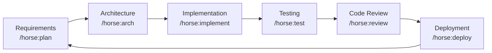

# horse-sense

> Mr. Ed's practical and powerful Claude Code plugin with agents, skills and rules.

**horse-sense** is a publicly available [Claude Code](https://claude.ai/code) plugin that guides autonomous software development through a structured SDLC methodology. It provides agents, skills, rules, templates, and bash scripts to help you ship software faster and more consistently.

---

## What It Does

| Capability | Description |
|---|---|
| **Agents** | Specialized role prompts: Planner, Architect, Developer, Tester, Reviewer |
| **Skills** | Step-by-step guides for every SDLC phase |
| **Rules** | Coding standards, documentation, testing, and git workflow rules |
| **Templates** | Fill-in-the-blank docs for project plans, requirements, architecture, and sprints |
| **Slash Commands** | Custom Claude commands to trigger SDLC workflows |
| **Scripts** | Bash scripts for environment setup, running tests, and linting |
| **Trails** | Structured workflow definitions that guide horse through the SDLC |

---

## Quick Start

```bash
# 1. Clone the plugin
git clone https://github.com/edlovesjava/horse-sense

# 2. Use it with Claude Code
claude --plugin-dir ./horse

# 3. Start the SDLC workflow
# /horse:guide
```

---

## Plugin Structure

```
horse-sense/
├── horse/                           ← THE PLUGIN (--plugin-dir target)
│   ├── .claude-plugin/
│   │   └── plugin.json             ← Plugin manifest (name: "horse")
│   ├── commands/                    ← User-invoked slash commands [auto-discovered]
│   │   ├── guide.md                ← /horse:guide
│   │   ├── plan.md                 ← /horse:plan
│   │   ├── arch.md                 ← /horse:arch
│   │   ├── implement.md            ← /horse:implement
│   │   ├── review.md               ← /horse:review
│   │   ├── test.md                 ← /horse:test
│   │   ├── deploy.md               ← /horse:deploy
│   │   ├── sprint.md               ← /horse:sprint
│   │   └── retrospective.md        ← /horse:retrospective
│   ├── agents/                      ← Specialized role agents [auto-discovered]
│   │   ├── planner.md
│   │   ├── architect.md
│   │   ├── developer.md
│   │   ├── tester.md
│   │   └── reviewer.md
│   ├── skills/                      ← Model-invoked SKILL.md guides [auto-discovered]
│   │   ��── python-venv/SKILL.md
│   │   ├── requirements-analysis/SKILL.md
│   │   ├── architecture-design/SKILL.md
│   │   ├── implementation/SKILL.md
│   │   ├── testing/SKILL.md
│   │   └── deployment/SKILL.md
│   ├── bin/                         ← Executables added to PATH [auto-discovered]
│   ├── rules/                       ← Coding standards (supporting files)
│   ├── templates/                   ← Document scaffolds (supporting files)
│   ├── scripts/                     ← Shell automation (supporting files)
│   └── trails/                      ← Workflow definitions (supporting files, Phase 2)
├── docs/                            ← Project documentation (not part of plugin)
├── CLAUDE.md
├── README.md
└── LICENSE
```

---

## Slash Commands

Use these in Claude Code to trigger structured workflows:

| Command | Description |
|---|---|
| `/horse:guide` | Follow the SDLC trail: requirements → design → planning → implementation |
| `/horse:plan` | Create or update project plan and sprint backlog |
| `/horse:arch` | Design system architecture, generate diagrams and ADRs |
| `/horse:implement` | Implement a user story with TDD workflow |
| `/horse:review` | Code review against project standards |
| `/horse:test` | Create and run tests with coverage reporting |
| `/horse:deploy` | Deploy to staging or production with pre-flight checks |
| `/horse:sprint` | Plan and manage a sprint |
| `/horse:retrospective` | Facilitate a sprint retrospective |

---

## Agents

Agents are auto-discovered by the plugin manager:

| Agent | Best For |
|---|---|
| **planner** | Requirements, roadmaps, sprint planning |
| **architect** | System design, tech selection, ADRs |
| **developer** | Implementation, debugging, refactoring |
| **tester** | Test strategy, coverage, security scans |
| **reviewer** | Code review, security, performance |

---

## SDLC Workflow



---

## Prerequisites

- Python >= 3.11
- Git
- Bash-compatible shell (Linux / macOS / WSL)
- [Claude Code](https://claude.ai/code) with plugin support

---

## Contributing

1. Fork the repository
2. Create a branch: `git checkout -b feature/your-improvement`
3. Make your changes following the rules in `horse/rules/`
4. Open a pull request with a clear description

---

## License

See [LICENSE](LICENSE).
