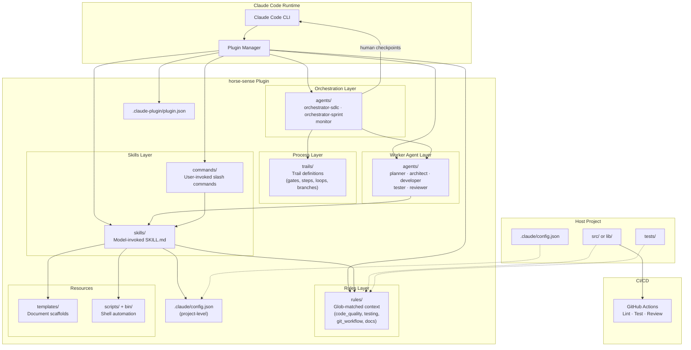
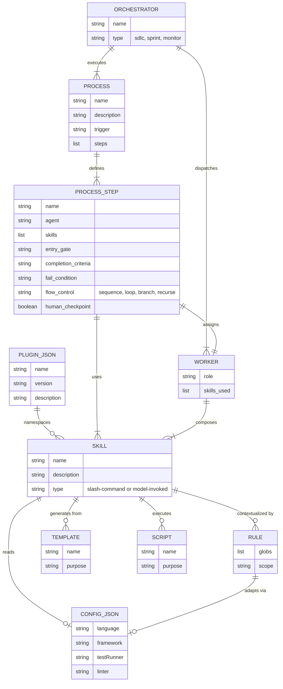
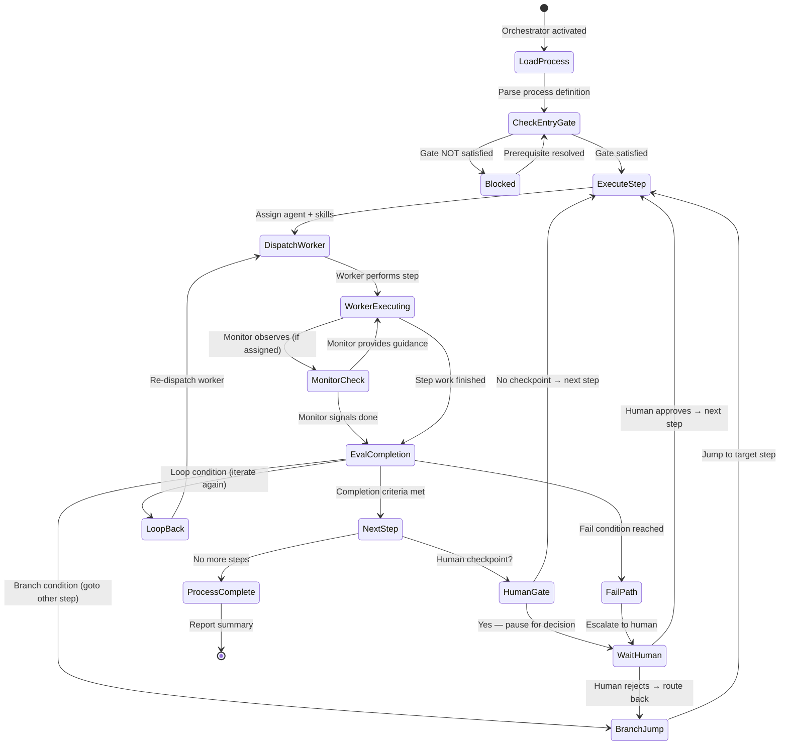
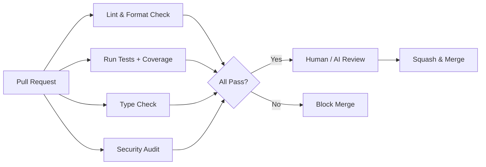

# Architecture Document: horse-sense

> **Document version**: 1.1  
> **Created**: 2026-04-03  
> **Last updated**: 2026-04-04  
> **Owner**: Ed Wentworth  
> **Status**: Draft

---

## 1. Context & Goals

### System Purpose

**horse-sense** is a project that produces a Claude Code plugin named **horse**. The plugin guides autonomous software development through a structured SDLC methodology, extending Claude Code with specialized agents, reusable skills, and document templates — turning the AI assistant into a disciplined development partner.

The plugin lives in the `horse/` subdirectory of the horse-sense repo and is distributed via `claude --plugin-dir ./horse` or Git clone. Once installed, it provides slash commands (`/horse:*`), agent personas, and model-invoked skills that adapt to the host project's language, framework, and conventions through a configuration file.

> **Important architectural constraint (resolved 2026-04-04)**: The official Claude Code plugin spec only auto-discovers these directories: `.claude-plugin/`, `commands/`, `agents/`, `skills/`, `hooks/`, `output-styles/`, `bin/`, and files `.mcp.json`, `.lsp.json`, `settings.json`. Directories like `rules/`, `templates/`, `trails/`, and `scripts/` are **not** recognized plugin components — they exist as supporting files that skills and agents reference by path, but the plugin manager does not auto-load them into context.

### Target Users

- Individual developers and small teams using Claude Code for day-to-day development
- Teams wanting repeatable SDLC process without heavy tooling

### Quality Attribute Priorities

| # | Quality Attribute | Target |
|---|---|---|
| 1 | Extensibility | New skills and agents added without changing core structure |
| 2 | Adaptability | Works across Python and TypeScript projects via configuration |
| 3 | Simplicity | No build step, no runtime dependencies — plain Markdown + shell scripts |
| 4 | Discoverability | Users find the right skill/agent through clear naming and `/horse:guide` |

### Constraints

- Must conform to official Claude Code plugin spec (`.claude-plugin/plugin.json`)
- No runtime dependencies beyond what Claude Code provides (Bash, standard CLI tools)
- Skills must work for both Python (venv, pytest, ruff) and TypeScript (npm, vitest/jest, eslint) projects
- Personal / small-team distribution — Git clone or simple marketplace install

---

## 2. System Architecture

### Architecture Style

**Static plugin with layered content and process orchestration** — horse-sense is not a running service. It is a structured collection of Markdown documents, shell scripts, configuration, and process definitions that Claude Code loads at session start. The architecture has these layers:

- **Agents** (auto-discovered by plugin manager) — flat `.md` files with YAML frontmatter (`name`, `description`, `model`, `effort`, `maxTurns`, `tools`, `disallowedTools`, etc.) defining specialized subagent personas
- **Skills** (auto-discovered) — `SKILL.md` files with frontmatter, model-invoked based on task context
- **Commands** (auto-discovered) — user-invoked slash commands (`/horse:*`) as flat `.md` files
- **bin/** (auto-discovered) — executables added to Bash tool's PATH
- **Supporting files** (NOT auto-discovered) — `templates/`, `scripts/`, `rules/`, `trails/` exist within the plugin directory as reference material that agents and skills read via `${CLAUDE_PLUGIN_ROOT}` paths, but the plugin manager does not inject them into context automatically
- **Configuration** adapts skills to a specific project (language, framework, test runner, paths)

### High-Level Component Diagram



### Component Descriptions

| Component | Auto-discovered? | Responsibility | Format |
|---|---|---|---|
| **plugin.json** | Yes | Plugin identity, version, author — loaded by Claude Code plugin manager | JSON manifest |
| **commands/** | Yes | User-invoked slash commands (`/horse:plan`, `/horse:arch`, etc.) | Markdown files |
| **skills/** | Yes | Model-invoked capabilities with `SKILL.md` + optional reference docs | Markdown |
| **agents/** | Yes | Agent personas with frontmatter — workers (Phase 1) + orchestrators (Phase 2) | Markdown with YAML frontmatter |
| **bin/** | Yes | Executable scripts added to Bash tool's PATH | Bash/Python/Node |
| **rules/** | **No** | Coding standards referenced by agent prompts and skill content | Markdown |
| **templates/** | **No** | Scaffolds for requirements, architecture, sprint plans, project plans | Markdown |
| **scripts/** | **No** | Shell automation (env setup, linting, testing, scaffolding) | Bash |
| **trails/** | **No** | Trail definitions with steps, gates, loops (Phase 2) | Markdown |
| **.claude/config.json** | N/A (host project) | Project-specific configuration consumed by skills | JSON |

---

## 3. Data Architecture

### Configuration Model

horse-sense uses a two-tier configuration model:

**Tier 1: Plugin manifest** (`horse/.claude-plugin/plugin.json`) — static, ships with the plugin:

```json
{
  "name": "horse",
  "description": "Structured SDLC plugin for Claude Code — agents, skills, and process orchestration",
  "version": "1.0.0",
  "author": { "name": "Ed Wentworth" }
}
```

**Tier 2: Project config** (`.claude/config.json`) — per-project, created by users:

```json
{
  "language": "python",
  "framework": "fastapi",
  "testRunner": "pytest",
  "linter": "ruff",
  "typeChecker": "mypy",
  "srcDir": "src",
  "testDir": "tests",
  "packageManager": "pip",
  "pythonVersion": "3.11",
  "coverageThreshold": 80,
  "branchingStrategy": "github-flow"
}
```

TypeScript project example:

```json
{
  "language": "typescript",
  "framework": "express",
  "testRunner": "vitest",
  "linter": "eslint",
  "typeChecker": "tsc",
  "srcDir": "src",
  "testDir": "tests",
  "packageManager": "npm",
  "nodeVersion": "20",
  "coverageThreshold": 80,
  "branchingStrategy": "github-flow"
}
```

Skills read `config.json` to adapt their guidance (e.g., which test command to run, which linter rules to reference).

### Content Relationships



---

## 4. Plugin Directory Layout

### Official Plugin Spec Mapping

The plugin lives in the `horse/` subdirectory of the horse-sense repo. Only directories and files marked **[auto-discovered]** are recognized by the Claude Code plugin manager. Everything else is supporting material referenced by skills/agents via `${CLAUDE_PLUGIN_ROOT}` paths.

```
horse-sense/                          # Project repo root
├── horse/                            # ← THE PLUGIN (--plugin-dir target)
│   ├── .claude-plugin/
│   │   └── plugin.json              # Plugin manifest: name="horse" [auto-discovered]
│   ├── commands/                     # User-invoked slash commands [auto-discovered]
│   │   ├── guide.md                 # /horse:guide
│   │   ├── plan.md                  # /horse:plan
│   │   ├── arch.md                  # /horse:arch
│   │   ├── implement.md             # /horse:implement
│   │   ├── review.md                # /horse:review
│   │   ├── test.md                  # /horse:test
│   │   ├── deploy.md                # /horse:deploy
│   │   ├── sprint.md                # /horse:sprint
│   │   └── retrospective.md        # /horse:retrospective
│   ├── skills/                       # Model-invoked agent skills [auto-discovered]
│   │   ├── requirements-analysis/
│   │   │   └── SKILL.md
│   │   ├── architecture-design/
│   │   │   └── SKILL.md
│   │   ├── implementation/
│   │   │   └── SKILL.md
│   │   ├── testing/
│   │   │   └── SKILL.md
│   │   ├── deployment/
│   │   │   └── SKILL.md
│   │   └── python-venv/
│   │       └── SKILL.md
│   ├── agents/                       # Agent personas — FLAT, with frontmatter [auto-discovered]
│   │   ├── planner.md               # name: planner, description: ...
│   │   ├── architect.md             # name: architect, description: ...
│   │   ├── developer.md            # name: developer, description: ...
│   │   ├── tester.md                # name: tester, description: ...
│   │   ├── reviewer.md             # name: reviewer, description: ...
│   │   ├── sdlc.md                  # SDLC orchestrator (Phase 2)
│   │   ├── sprint-orchestrator.md   # Sprint orchestrator (Phase 2)
│   │   └── monitor.md              # Quality monitor (Phase 2)
│   ├── bin/                          # Executables added to PATH [auto-discovered]
│   │   └── .gitkeep
│   ├── templates/                    # Document scaffolds [NOT auto-discovered]
│   │   ├── requirements_doc.md
│   │   ├── architecture_doc.md
│   │   ├── project_plan.md
│   │   └── sprint_plan.md
│   ├── scripts/                      # Shell automation [NOT auto-discovered]
│   │   ├── setup_env.sh
│   │   ├── run_tests.sh
│   │   ├── lint.sh
│   │   └── new_project.sh
│   ├── rules/                        # Coding standards reference [NOT auto-discovered]
│   │   ├── code_quality.md          # Referenced by agent prompts and skills
│   │   ├── testing.md
│   │   ├── git_workflow.md
│   │   └── documentation.md
│   └── trails/                       # Trail definitions [NOT auto-discovered] (Phase 2)
│       ├── feature_delivery.md
│       ├── sprint_execution.md
│       ├── bug_fix.md
│       └── code_review.md
├── docs/                             # Project documentation (NOT part of plugin)
│   ├── adr/
│   ├── architecture/
│   ├── plans/
│   └── requirements/
├── CLAUDE.md                         # Project-level instructions
├── README.md
└── LICENSE
```

### Key Structural Changes from Sprint 1 Layout

| Sprint 1 (current) | New Target | Reason |
|---|---|---|
| Plugin at repo root | Plugin in `horse/` subdirectory | Separates plugin from project; cleaner distribution |
| `name: "horse-sense"` | `name: "horse"` | Shorter namespace (`/horse:*` vs `/horse:*`) |
| `agents/workers/*.md` (no frontmatter) | `agents/*.md` (flat, with frontmatter) | Plugin spec requires flat `agents/` with YAML frontmatter |
| `rules/` assumed auto-loaded | `rules/` as reference files only | Plugin spec does NOT auto-discover `rules/` |
| `templates/` assumed auto-loaded | `templates/` as reference files only | Plugin spec does NOT auto-discover `templates/` |
| `agents/orchestrators/` (planned) | Flat in `agents/` (Phase 2) | Plugin spec auto-discovers flat `agents/` only |

---

## 5. Trail & Orchestration Architecture

### Trail Definition Format

Trail documents live in `trails/` and define workflows as structured Markdown with frontmatter:

```markdown
---
name: trail-name
description: What this trail accomplishes
trigger: /horse:command  # optional slash command trigger
---
```

Each trail document contains:

| Element | Purpose | Example |
|---|---|---|
| **Entry gate** | Preconditions (checklist) that must be satisfied before the trail starts | `- [ ] requirements_doc.md exists` |
| **Steps** | Ordered sequence of work units | `### Step 1: Requirements` |
| **Agent assignment** | Which worker agent executes the step | `- **Agent**: planner` |
| **Skills & tools** | Which skills the step uses | `- **Skills**: requirements-analysis` |
| **Monitor** | Optional monitor agent for loops | `- **Monitor**: monitor` |
| **Completion criteria** | How to know the step succeeded | `- **Completion**: all tests pass` |
| **Fail conditions** | When to abort or escalate | `- **Fail**: 5 iterations without convergence` |
| **Human checkpoints** | Points requiring human decision | `- **Gate**: HUMAN APPROVAL` |
| **Flow control** | Loops, branches, sub-process references | `- **Loop**: write → test → fix` |

### Flow Control Primitives

| Primitive | Syntax in Trail Doc | Behavior |
|---|---|---|
| **Sequence** | Steps numbered in order | Execute step N, then step N+1 |
| **Loop** | `- **Loop**: step_a → step_b → step_c` | Repeat until `- **Loop exit**: condition` |
| **Branch** | `- **Branch**: If condition → GOTO Step N` | Conditional jump to another step |
| **Recurse** | `- **Sub-trail**: trails/other.md` | Load and execute a child trail, return when done |
| **Human gate** | `- **Gate**: HUMAN APPROVAL` | Pause, present summary, wait for human response |
| **Fail/escalate** | `- **Fail**: condition → HUMAN DECISION` | Halt step, present options to human |

### Orchestrator Execution Model



### Agent Interaction Pattern

```
┌─────────────────────────────────────────────────────────┐
│ ORCHESTRATOR (e.g., SDLC Orchestrator)                  │
│                                                         │
│  1. Load process definition                             │
│  2. Check entry gate                                    │
│  3. For each step:                                      │
│     a. Evaluate entry conditions                        │
│     b. Dispatch worker agent with skills + context      │
│     c. (Optional) Activate monitor on loops             │
│     d. Evaluate completion / fail / loop / branch       │
│     e. If HUMAN GATE → pause, present, wait             │
│  4. Report execution summary                            │
│                                                         │
│  ┌──────────┐  ┌──────────┐  ┌──────────┐             │
│  │ Planner  │  │Developer │  │ Tester   │  ...workers  │
│  │ (worker) │  │(worker)  │  │ (worker) │              │
│  └────┬─────┘  └────┬─────┘  └────┬─────┘             │
│       │              │              │                    │
│       ▼              ▼              ▼                    │
│    Skills         Skills         Skills                  │
│    + Rules        + Rules        + Rules                 │
│    + Config       + Config       + Config                │
│                                                         │
│  ┌──────────┐                                           │
│  │ Monitor  │ ← observes loops, intervenes if needed    │
│  │ (orch.)  │                                           │
│  └──────────┘                                           │
└─────────────────────────────────────────────────────────┘
```

### Shipped Trail Definitions

| Trail | Trigger | Steps | Use Case |
|---|---|---|---|
| `feature_delivery.md` | `/horse:guide` | Requirements → Architecture → Implementation → Testing → Review → Deploy | Full feature lifecycle |
| `sprint_execution.md` | `/horse:sprint` | For each story: Implement → Test → Review | Sprint iteration |
| `bug_fix.md` | (manual) | Reproduce → Root cause → Fix → Regression test → Review | Bug triage and fix |
| `code_review.md` | `/horse:review` | Review → Feedback → Author fixes → Re-review | Review cycle |

---

## 6. Skill Architecture

### Skill Types

**Slash-command skills** (`commands/`) — explicitly invoked by users:

- Trigger: user types `/horse:<command>`
- Content: Markdown instructions for Claude, with `$ARGUMENTS` placeholder
- Example: `/horse:implement add user authentication`

**Model-invoked skills** (`skills/`) — automatically triggered by Claude based on context:

- Trigger: Claude recognizes the need based on SKILL.md `description` field
- Content: SKILL.md with YAML frontmatter (`name`, `description`) + guide body
- May include sibling reference docs and scripts

### Skill ↔ Config Integration

Skills read `.claude/config.json` to adapt behavior. Example pattern inside a SKILL.md:

```markdown
## Configuration

Read `.claude/config.json` for project settings. Adapt commands based on:
- `language`: "python" → use pytest, ruff; "typescript" → use vitest, eslint
- `testRunner`: determines test execution command
- `srcDir` / `testDir`: determines file paths
```

### Skill ↔ Rule Interaction

Rules provide ambient context. When a user edits a `.py` file, `rules/code_quality.md` (glob: `**/*.py`) injects Python-specific standards. When the `implementation` skill is active, it benefits from this context without explicitly loading it.

---

## 7. Dual Toolchain Support

### Detection Strategy

Scripts in `scripts/` and `bin/` detect the project language from `.claude/config.json` or by file presence:

| Signal | Language |
|---|---|
| `pyproject.toml` or `requirements.txt` | Python |
| `package.json` or `tsconfig.json` | TypeScript |
| `.claude/config.json` → `language` | Explicit override |

### Toolchain Matrix

| Concern | Python | TypeScript |
|---|---|---|
| Package manager | pip + venv | npm / pnpm |
| Linter | ruff | eslint |
| Formatter | ruff format | prettier |
| Type checker | mypy | tsc |
| Test runner | pytest | vitest / jest |
| Coverage | pytest-cov | c8 / istanbul |
| Security audit | pip audit | npm audit |
| Build | setuptools / hatch | tsc / esbuild |

Skills reference this matrix via config, not hardcoded assumptions.

---

## 8. CI/CD & GitHub Actions

### Review Workflow



### Shipped Workflow Template

The plugin ships a GitHub Actions workflow template in `templates/ci.yml` that projects can copy to `.github/workflows/`. It supports both Python and TypeScript via a matrix strategy keyed on `.claude/config.json`.

---

## 9. Architecture Decision Records

| ADR | Title | Status |
|---|---|---|
| [ADR-0001](./adr/0001-adopt-official-plugin-format.md) | Adopt official Claude Code plugin format | Accepted |
| [ADR-0002](./adr/0002-two-tier-configuration.md) | Two-tier configuration model (plugin.json + config.json) | Accepted |
| [ADR-0003](./adr/0003-dual-toolchain-support.md) | Dual Python/TypeScript toolchain support via config | Accepted |
| [ADR-0004](./adr/0004-process-orchestration-model.md) | Process orchestration — workers, orchestrators, and monitors | Accepted |

---

## 10. Open Questions & Risks

| # | Question / Risk | Owner | Resolution |
|---|---|---|---|
| 1 | Will `rules/` and `templates/` dirs be recognized by plugin manager or need workaround? | Ed | ✅ **Resolved 2026-04-04** — NO. Plugin manager only auto-discovers: `.claude-plugin/`, `commands/`, `agents/`, `skills/`, `hooks/`, `output-styles/`, `bin/`, `.mcp.json`, `.lsp.json`, `settings.json`. Rules and templates must be referenced explicitly by skills/agents via `${CLAUDE_PLUGIN_ROOT}/rules/` paths. |
| 2 | SKILL.md frontmatter schema — what fields beyond `name` and `description` are supported? | Ed | ✅ **Resolved 2026-04-04** — Skills support `name`, `description`, `disable-model-invocation`. Agents support `name`, `description`, `model`, `effort`, `maxTurns`, `tools`, `disallowedTools`, `skills`, `memory`, `background`, `isolation`. Agents do NOT support `hooks`, `mcpServers`, or `permissionMode`. |
| 3 | Can hooks/ be used to auto-inject rules based on file globs, or is that handled by settings? | Ed | ✅ **Resolved 2026-04-04** — Hooks respond to lifecycle events (PostToolUse, PreToolUse, etc.) not file globs. The `InstructionsLoaded` and `FileChanged` events exist but are not glob-pattern rule injection. Rules content should be folded into agent system prompts or referenced by skills. |
| 4 | Should `bin/hs` CLI helper exist or is it unnecessary overhead for personal use? | Ed | ⬜ Open — defer until needed |
| 5 | How do orchestrators dispatch workers — Agent tool, subagents, or context switching? | Ed | ✅ **Resolved 2026-04-04** — Plugin agents appear in `/agents` and can be invoked by Claude via the Agent tool as subagents. They work alongside built-in agents. Orchestrators dispatch workers as subagents. |
| 6 | Can monitor agents run concurrently with workers or only between iterations? | Ed | ⬜ Open — depends on Claude Code concurrency model (Agent tool supports `run_in_background`) |
| 7 | Should process definitions support parameters (e.g., max loop iterations configurable per project)? | Ed | ⬜ Open — start without, add if needed |
| 8 | `agents/` must be flat — how to distinguish workers from orchestrators? | Ed | ✅ **Resolved 2026-04-04** — Use naming convention and `description` frontmatter. Workers: `planner.md`, `developer.md`, etc. Orchestrators: `sdlc.md`, `sprint-orchestrator.md`, `monitor.md`. The `description` field tells Claude when to invoke each. |
