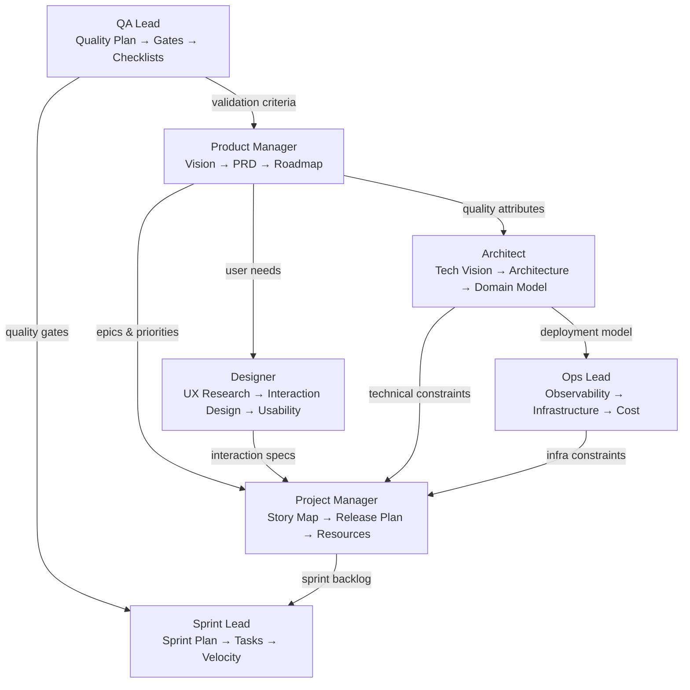

# SPIKE-006: Leadership Team Views for Multi-Horizon Planning

> **Status**: Complete
> **Author**: Scout agent
> **Date**: 2026-04-07
> **Timebox**: 2 hours

---

## Question

The horse-sense plugin currently operates at the sprint execution level — stories, tasks, velocity. But real product development requires multiple leadership perspectives operating at different horizons. How should the plugin support a full leadership team with distinct views: product manager, project manager, sprint lead, QA lead, UX designer, architect, and ops lead? What artifacts, skills, and agent enhancements are needed?

## Approach

- [x] Define each leadership view and its planning horizon
- [x] Map each view to existing plugin capabilities and identify gaps
- [x] Evaluate artifact types needed per view
- [x] Assess whether existing agents cover these roles or need new/enhanced personas
- [x] Propose a layered planning model that connects the views

## Findings

### Finding 1: Three Planning Horizons

The leadership team operates across three time horizons that nest inside each other:

```
Strategic (quarters/releases)     ← Product Manager, Architect, Ops
  └─ Tactical (sprints/iterations) ← Project Manager, QA Lead, Designer
       └─ Operational (days/tasks)  ← Sprint Lead (current planner role)
```

The plugin currently handles only the operational horizon well. The strategic and tactical horizons are ad-hoc or absent.

### Finding 2: Seven Leadership Views

Each view has a distinct perspective, artifacts, and success criteria:

#### View 1: Product Manager — "What and Why"

**Horizon**: Strategic (quarters)
**Focus**: Market fit, customer value, business outcomes

| Artifact | Purpose |
|---|---|
| **Product Vision** | North-star statement, target users, value proposition, differentiation |
| **Product Requirements Document (PRD)** | Problem statement, user personas, jobs-to-be-done, success measures (OKRs/KPIs) |
| **Product Roadmap** | Milestones → Phases → Epics, sequenced by value and dependencies |
| **Success Measures** | Adoption metrics, revenue targets, NPS, feature usage, time-to-value |

**Current plugin coverage**: Minimal. The planner writes project plans with milestones, but there's no product vision, PRD, or outcome-based success measures. The requirements doc captures *what* to build but not *why* in business terms.

#### View 2: Project Manager — "How and When"

**Horizon**: Tactical (sprints/releases)
**Focus**: Delivery predictability, resource allocation, risk management

| Artifact | Purpose |
|---|---|
| **Story Map** | User activities → tasks → stories, organized by release slices |
| **Release Plan** | Stories grouped into incremental releases with scope, dates, dependencies |
| **Resource Allocation** | Team capacity across sprints, skill-based assignment, load balancing |
| **Risk Register** | Project risks with probability, impact, mitigation, and owner |
| **Dependency Graph** | Inter-story and external dependencies with critical path |

**Current plugin coverage**: Partial. Sprint planning exists. Missing: story mapping, release planning, resource allocation across sprints, dependency analysis, formal risk register. (See SPIKE-005 findings.)

#### View 3: Sprint Lead — "Who Does What Now"

**Horizon**: Operational (days/tasks)
**Focus**: Sprint execution, blocker removal, daily progress

| Artifact | Purpose |
|---|---|
| **Sprint Plan** | Sprint goal, backlog, capacity, task assignments |
| **Task Board** | Status tracking (To Do, In Progress, Review, Done, Blocked) |
| **Daily Standup Notes** | What/Today/Blockers per team member |
| **Burndown/Velocity** | Progress tracking against sprint commitment |

**Current plugin coverage**: Strong. The planner agent + `/horse:sprint` command handles this well. This is where the plugin excels today.

#### View 4: QA Lead — "How Good Is It"

**Horizon**: Tactical (per-release and per-sprint)
**Focus**: Quality gates, verification & validation, compliance

| Artifact | Purpose |
|---|---|
| **Quality Plan** | Test strategy, coverage targets, quality gates per phase |
| **Verification Checklist** | Did we build it right? Unit, integration, e2e, performance, security test results |
| **Validation Checklist** | Did we build the right thing? Acceptance criteria met, user feedback, UAT sign-off |
| **Quality Gates** | Entry/exit criteria per SDLC phase (requirements → design → code → test → deploy) |
| **Defect Register** | Known bugs, severity, status, linked to stories |

**Current plugin coverage**: Partial. The tester agent handles test strategy and coverage. The trainer audits process compliance. Missing: formal quality plan, verification/validation checklists as distinct concerns, phase-level quality gates as a managed artifact, defect tracking.

#### View 5: Designer — "How People Use It"

**Horizon**: Tactical (per-feature/epic)
**Focus**: User experience, usability, accessibility, human factors

| Artifact | Purpose |
|---|---|
| **UX Research Summary** | User interviews, personas, pain points, journey maps |
| **Interaction Design** | Wireframes, user flows, information architecture (Mermaid state/flow diagrams) |
| **Design System** | Component library, style guide, accessibility standards |
| **Usability Criteria** | Task success rate, error rate, learnability, accessibility (WCAG) targets |
| **Human Factors Checklist** | Cognitive load, error prevention, feedback, recovery, consistency |

**Current plugin coverage**: None. No agent, skill, or template addresses UX design, usability, or human factors. The architect handles *system* design but not *user experience* design.

#### View 6: Architect — "How It's Built"

**Horizon**: Strategic (system lifetime)
**Focus**: Technical vision, structural integrity, domain modeling

| Artifact | Purpose |
|---|---|
| **Technical Vision** | Architectural principles, technology strategy, quality attributes (the "-ilities") |
| **System Architecture** | Component diagrams, deployment diagrams, integration patterns |
| **Domain Model** | Domain-driven design: bounded contexts, aggregates, context map |
| **ADRs** | Architecture Decision Records for significant technical choices |
| **API Contracts** | Interface definitions, versioning strategy, compatibility guarantees |

**Current plugin coverage**: Good. The architect agent + architecture-design skill covers system architecture, ADRs, and API contracts. Missing: explicit technical vision document, domain-driven design artifacts (bounded contexts, context maps, aggregate definitions), quality attribute scenarios.

#### View 7: Ops Lead — "How It Runs"

**Horizon**: Strategic (ongoing)
**Focus**: Reliability, observability, cost, infrastructure

| Artifact | Purpose |
|---|---|
| **Observability Requirements** | SLOs, SLIs, alerting thresholds, logging/tracing/metrics strategy |
| **Infrastructure Plan** | Compute, storage, networking, scaling strategy, disaster recovery |
| **Deployment Architecture** | Environments, promotion pipeline, rollback strategy, blue/green/canary |
| **Cost Model** | Infrastructure cost estimates, scaling projections, budget constraints |
| **Runbook** | Operational procedures for incidents, failovers, maintenance windows |

**Current plugin coverage**: Partial. The deployment skill covers CI/CD, Docker, and rollback. Missing: observability requirements as a first-class artifact, infrastructure planning, cost modeling, SLO/SLI definitions.

### Finding 3: How the Views Connect

The views aren't independent — they form a dependency chain:



**Key insight**: The Product Manager feeds *what* to build into the system. The Architect and Designer feed *how* (technically and experientially). The Project Manager sequences *when*. QA and Ops constrain *how well* and *how reliably*. The Sprint Lead executes.

### Finding 4: Current Agent Mapping

| Leadership View | Existing Agent | Coverage | Gap |
|---|---|---|---|
| Product Manager | planner (partial) | Milestones, story estimation | No vision, PRD, roadmap, success measures |
| Project Manager | planner (partial) | Sprint planning | No story map, release plan, resource allocation, dependencies |
| Sprint Lead | planner | Good | Minor: no burndown visualization |
| QA Lead | tester + trainer | Test strategy + process audit | No quality plan, V&V checklists, defect register |
| Designer | *(none)* | None | Entirely missing |
| Architect | architect | Good | No tech vision doc, no DDD artifacts |
| Ops Lead | *(partial via deployment skill)* | CI/CD, Docker, rollback | No observability reqs, infra plan, cost model |

## Trade-off Matrix

| Option | Pros | Cons | Effort | Risk |
|---|---|---|---|---|
| **A. Add all 7 views as agents + skills** | Complete coverage; mirrors real teams; each view has dedicated guidance | Massive scope (50+ SP); overwhelming for solo developers; many agents to discover | Very High (50-80 SP) | High — scope creep, user confusion |
| **B. Enhance existing agents + add 2-3 new views** | Builds on proven base; fills critical gaps first; manageable scope | Some views still missing; may need future iteration | High (30-45 SP) | Medium — phased delivery mitigates |
| **C. Add leadership "lenses" as skills, not agents** | Any agent can adopt a view; no new agents; flexible composition | Loses the persona/perspective benefit; planning skills without domain expertise | Medium (20-30 SP) | Medium — skills may be too generic |
| **D. Phased: core views now, extended views later** | Ships value fast; validates the model; defers complexity | Requires upfront design for extensibility; two rounds of stories | Medium initial (20-25 SP), Medium later (20-25 SP) | Low — incremental validation |

## Recommendation

**Option D: Phased delivery with two tiers.**

### Phase 1: Core Leadership Views (Priority: Must Have)

Enhance existing agents and add the most critical missing view:

| View | Approach | Key Artifacts | Est. SP |
|---|---|---|---|
| **Product Manager** | Enhance planner agent + add product-planning skill | Product vision, PRD, product roadmap, success measures | 8 |
| **Project Manager** | Add release-planning skill + `/horse:refine` command (per SPIKE-005) | Story map, release plan, dependency graph, resource allocation | 8 |
| **QA Lead** | Enhance tester agent + add quality-planning skill | Quality plan, V&V checklists, quality gates, defect register | 8 |

**Why these three first?**
- Product Manager view provides the *strategic direction* that everything else flows from
- Project Manager view provides the *tactical coordination* (SPIKE-005's core finding)
- QA Lead view provides *quality governance* that the trainer audits against but nobody actively manages

### Phase 2: Extended Leadership Views (Priority: Should Have)

Add the remaining views after Phase 1 validates the model:

| View | Approach | Key Artifacts | Est. SP |
|---|---|---|---|
| **Designer** | New designer agent + ux-design skill | UX research, interaction design, usability criteria, human factors checklist | 8 |
| **Architect (enhanced)** | Add technical-vision skill + ddd skill | Technical vision doc, bounded contexts, context map, quality attribute scenarios | 5 |
| **Ops Lead** | New ops agent + ops-planning skill | Observability requirements, infrastructure plan, cost model, SLO/SLI definitions | 8 |

### Supporting Changes (Both Phases)

| Change | Phase | Purpose |
|---|---|---|
| Add `depends_on` field to user_story.md frontmatter | 1 | Enable dependency tracking |
| Add product_vision.md template | 1 | Scaffold product vision artifact |
| Add prd.md template | 1 | Scaffold product requirements document |
| Add quality_plan.md template | 1 | Scaffold quality planning artifact |
| Add release_roadmap.md template | 1 | Scaffold multi-phase release plan |
| Add ux_research.md template | 2 | Scaffold UX research findings |
| Add technical_vision.md template | 2 | Scaffold architectural vision |
| Add observability_requirements.md template | 2 | Scaffold ops requirements |
| Enhance project_plan.md template | 1 | Add roadmap section, dependency tracking |
| Enhance sprint_plan.md template | 1 | Add quality gate checklist, velocity history |

### Naming: "Leadership Team" in the Plugin

The leadership views should be accessible via a convention:

- **Agent personas** stay role-named: planner, architect, tester, designer, ops
- **Skills** are named by concern: product-planning, release-planning, quality-planning, ux-design, ops-planning
- **Templates** are named by artifact: product_vision.md, prd.md, quality_plan.md, release_roadmap.md
- **A new `/horse:roadmap` command** could present the product roadmap view
- **A new `/horse:quality` command** could present the QA dashboard view

## Open Questions

- [ ] Should the product vision and PRD be separate documents or sections of an enhanced requirements_doc.md?
- [ ] Should the designer agent be a new agent or a "lens" the architect adopts for user-facing work?
- [ ] Should the ops agent be new or an extension of the deployment skill into a broader ops concern?
- [ ] How much of the QA view overlaps with the trainer's process audit? Should the trainer evolve into the QA lead?
- [ ] Should quality gates be defined per-project in a quality_plan.md or built into the plugin's trail definitions?
- [ ] Is a `/horse:dashboard` command useful to present a consolidated leadership summary?

## Next Steps

- [ ] Draft user stories for Phase 1 views (Product Manager, Project Manager, QA Lead)
- [ ] Draft user stories for supporting template and frontmatter changes
- [ ] Review whether the planner agent should split into product-planner and project-planner personas, or remain one agent that composes different skills
- [ ] Validate Phase 1 scope against upcoming sprint capacity
- [ ] Defer Phase 2 stories until Phase 1 is delivered and validated
