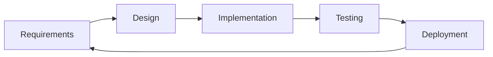

# Rule: Documentation

Every project using horse-sense follows these documentation standards. Good documentation enables new contributors to get productive quickly and reduces the bus-factor risk.

## Required Documentation

### 1. `README.md` (root level)
Every project must have a `README.md` covering:
- **What it is** — one-paragraph description
- **Prerequisites** — runtime/build requirements
- **Quick start** — five commands or fewer to get it running
- **Configuration** — environment variables and their defaults
- **Testing** — how to run the test suite
- **Deployment** — how to deploy
- **Contributing** — where to find contribution guidelines

### 2. `CHANGELOG.md`
Track all notable changes following [Keep a Changelog](https://keepachangelog.com/):
```markdown
# Changelog

## [Unreleased]

## [1.2.0] - 2025-04-01
### Added
- Password reset feature (#42)

### Fixed
- Race condition in session management (#38)

## [1.1.0] - 2025-03-15
...
```

### 3. `docs/` Directory
Longer-form documentation lives here:
```
docs/
├── adr/           ← Architecture Decision Records
├── api/           ← API reference (OpenAPI / auto-generated)
├── runbooks/      ← Operational runbooks
└── retros/        ← Sprint retrospective notes
```

### 4. Code-Level Documentation
- Public functions and classes: Google-style docstrings (see `rules/code_quality.md`)
- Complex algorithms: inline comments explaining *why*, not *what*
- Configuration files: comments for non-obvious settings

## Documentation as Code

- Documentation lives in the same repository as code
- Documentation changes are reviewed in the same PR as code changes
- Stale documentation is a bug — update it when the code changes

## Markdown Standards

- Use ATX-style headings (`#`, `##`, `###`)
- Use fenced code blocks with language identifiers (` ```python `)
- Use tables for structured comparisons
- Wrap lines at 100 characters
- One blank line between sections

## Diagrams

Use [Mermaid](https://mermaid.js.org/) for diagrams embedded in markdown — no binary files needed:



## Docstring Example

```python
class UserService:
    """Service layer for user management operations.

    Provides create, read, update, and delete operations for user
    accounts, delegating persistence to the UserRepository.

    Attributes:
        repository: The underlying data access object.
        email_service: Service for sending transactional emails.
    """

    def create_user(self, email: str, password: str) -> User:
        """Create a new user account.

        Args:
            email: The user's email address (must be unique).
            password: Plain-text password (will be hashed).

        Returns:
            The newly created User object.

        Raises:
            DuplicateEmailError: If the email is already registered.
            WeakPasswordError: If the password fails strength requirements.
        """
```

## Anti-Patterns to Avoid

- **Undocumented environment variables** — always document every `os.getenv()` call
- **"See the code"** — the code explains *what*, docs explain *why*
- **Outdated screenshots** — prefer text or Mermaid diagrams that won't go stale
- **Docs in a separate wiki** — wikis drift from reality; keep docs in the repo
