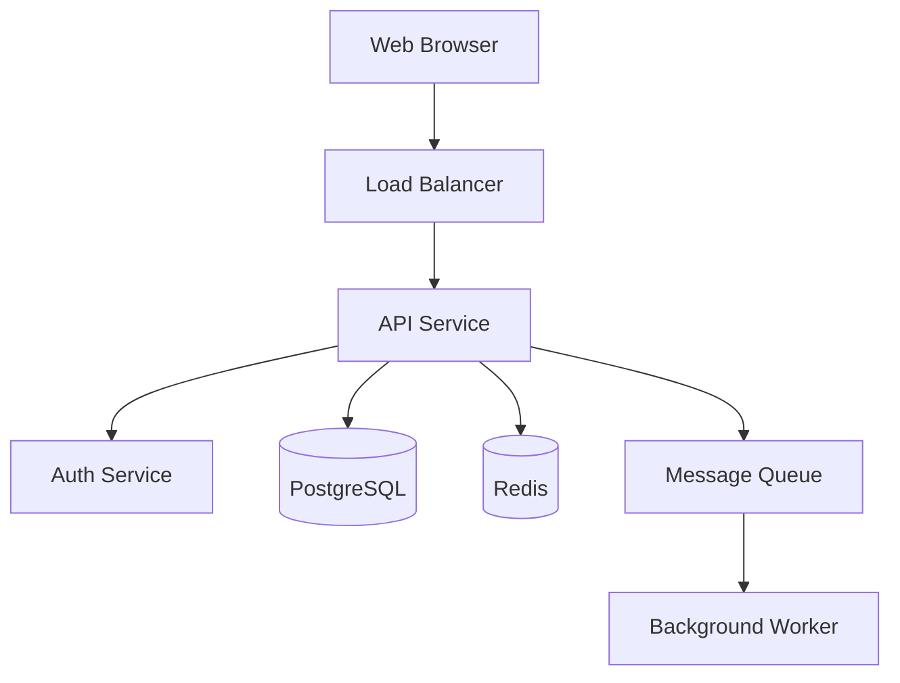
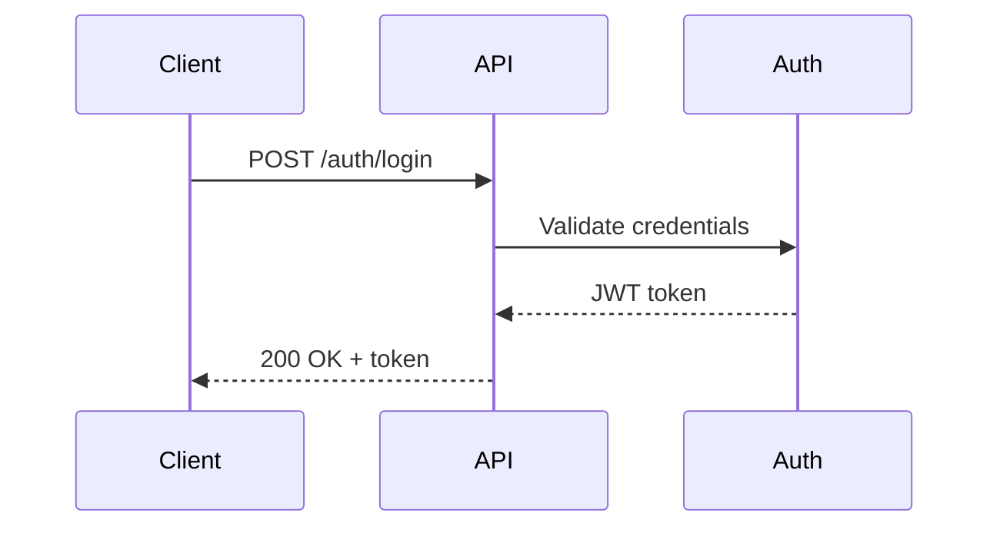

# Skill: Architecture Design

## Purpose

Translate requirements into a coherent, scalable system design before implementation begins. Good architecture reduces technical debt, enables independent team work, and makes the system easier to evolve.

## Architecture Process

```
Understand Context → Identify Constraints → Generate Options → Decide → Document
```

### 1. Understand the Context

Before drawing boxes and arrows, answer:

- What are the quality attributes driving this design? (see NFRs)
- What is the expected scale (users, data, requests/sec)?
- What is the team's size and experience level?
- What is the operational environment (cloud, on-prem, serverless)?
- What existing systems must this integrate with?

### 2. Choose an Architecture Style

| Style | Best For | Trade-offs |
|---|---|---|
| **Monolith** | Small teams, early-stage products | Simple to start; hard to scale later |
| **Modular Monolith** | Growing teams needing internal structure | Good balance of simplicity and structure |
| **Microservices** | Large teams, independent scaling needs | Operational complexity; needs DevOps maturity |
| **Event-Driven** | Async workflows, decoupled producers/consumers | Debugging complexity; eventual consistency |
| **Serverless** | Bursty workloads, low operational overhead | Cold starts; vendor lock-in |

### 3. Design the Components

Identify:

- **Bounded contexts** — logical areas of responsibility (Domain-Driven Design)
- **Service interfaces** — public APIs between components
- **Data ownership** — which component owns which data
- **Cross-cutting concerns** — authentication, logging, observability

### 4. Data Architecture

- Choose storage type: relational (PostgreSQL), document (MongoDB), key-value (Redis), time-series (InfluxDB), graph (Neo4j)
- Design the schema or data model
- Define data access patterns and indexes
- Plan for data migration and versioning

### 5. API Design

For REST APIs:

```
GET    /resources          → list
GET    /resources/{id}     → get one
POST   /resources          → create
PUT    /resources/{id}     → replace
PATCH  /resources/{id}     → partial update
DELETE /resources/{id}     → delete
```

Version APIs from the start: `/api/v1/resources`

### 6. Security Architecture

- Authentication: OAuth 2.0 / OIDC / JWT
- Authorization: RBAC or ABAC
- Secrets management: environment variables, secrets managers (Vault, AWS Secrets Manager)
- Network security: TLS everywhere, principle of least privilege
- Input validation at every boundary

### 7. Observability

Design for:

- **Logging**: structured JSON logs with correlation IDs
- **Metrics**: RED (Rate, Errors, Duration) for services
- **Tracing**: distributed traces across service boundaries
- **Alerting**: actionable alerts, not noise

### 8. Document the Architecture

Create `templates/architecture_doc.md` and write an ADR for each significant decision.

**ADR format** (`docs/adr/NNNN-title.md`):

```markdown
# ADR-0001: Use PostgreSQL for Primary Storage

## Status
Accepted

## Context
We need a reliable relational database for...

## Decision
We will use PostgreSQL 16 because...

## Consequences
+ ACID guarantees
+ Rich query capabilities
- Requires managed service or DBA expertise
```

## Diagramming with Mermaid

### Component Diagram



### Sequence Diagram



## Common Mistakes to Avoid

- Designing for 10× scale you don't have yet
- Skipping API contract definition before implementation
- Ignoring failure modes (what happens when the database is down?)
- No operational runbook — who gets paged at 2 AM?
