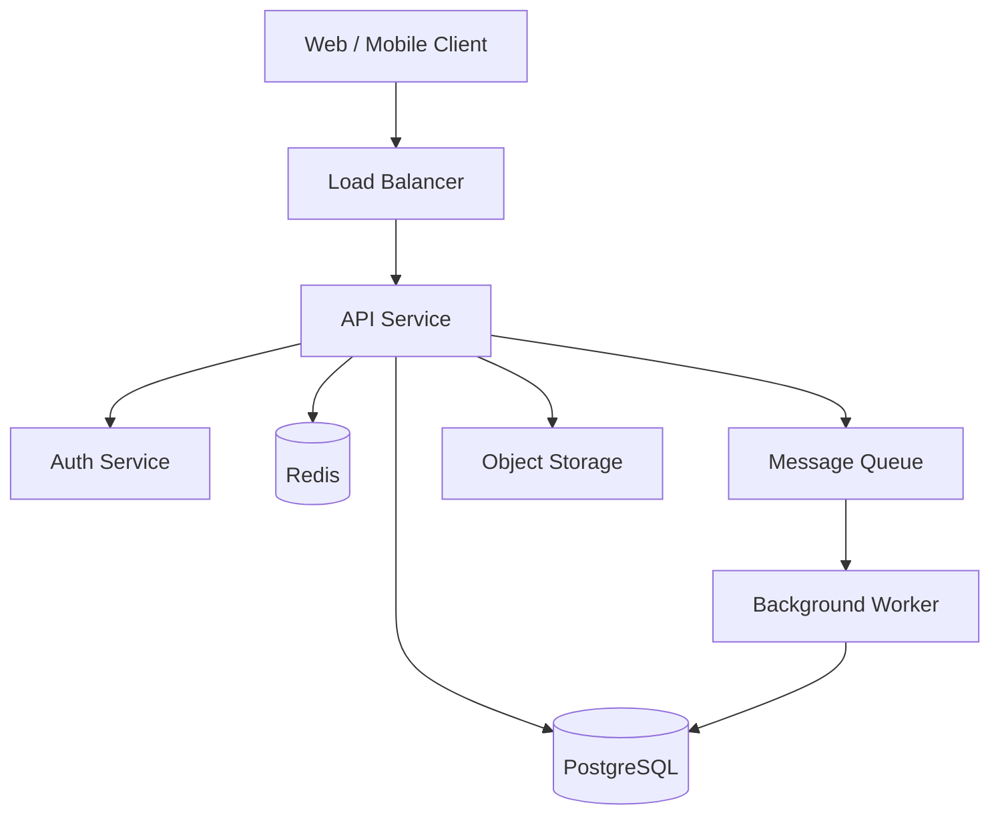
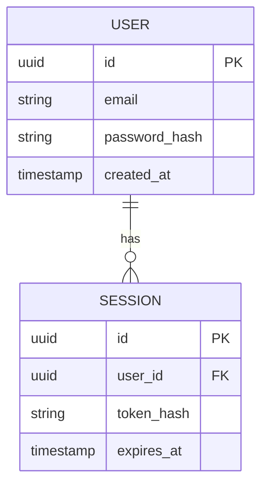
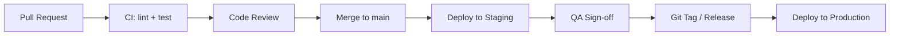

# Architecture Document: [Project Name]

> **Document version**: 1.0  
> **Created**: [Date]  
> **Last updated**: [Date]  
> **Owner**: [Architect Name]  
> **Status**: Draft | In Review | Approved

---

## 1. Context & Goals

### System Purpose

_What does this system do? Who uses it?_

### Quality Attribute Priorities

Ranked by importance for this system:

| # | Quality Attribute | Target |
|---|---|---|
| 1 | [e.g., Reliability] | [e.g., 99.9% uptime] |
| 2 | [e.g., Performance] | [e.g., p99 < 200ms] |
| 3 | [e.g., Security] | [e.g., SOC 2 compliant] |
| 4 | [e.g., Maintainability] | [e.g., MTTR < 30min] |

### Constraints

- [Technology constraint, e.g., must use existing PostgreSQL database]
- [Team constraint, e.g., team has Python expertise, not Go]
- [Operational constraint, e.g., must deploy on AWS]

---

## 2. System Architecture

### Architecture Style

_[Describe the chosen style: modular monolith / microservices / event-driven / etc. and the rationale.]_

### High-Level Component Diagram



### Component Descriptions

| Component | Responsibility | Technology |
|---|---|---|
| API Service | HTTP request handling, business logic | [e.g., FastAPI] |
| Auth Service | Authentication, token issuance | [e.g., FastAPI + JWT] |
| Background Worker | Async task processing | [e.g., Celery] |
| Database | Persistent data storage | [e.g., PostgreSQL 16] |
| Cache | Session store, query cache | [e.g., Redis 7] |
| Message Queue | Async communication | [e.g., RabbitMQ / SQS] |
| Object Storage | Files, media | [e.g., S3] |

---

## 3. Data Architecture

### Data Model (simplified)



### Storage Decisions

| Data Type | Store | Rationale |
|---|---|---|
| User accounts | PostgreSQL | ACID, relational |
| Sessions | Redis | Fast expiry, low latency |
| Uploaded files | S3 | Scalable object storage |
| Audit logs | PostgreSQL | Query-ability, compliance |

---

## 4. API Design

### Base URL

```
https://api.example.com/v1
```

### Authentication

All endpoints (except `/auth/*`) require:

```
Authorization: Bearer <JWT token>
```

### Core Endpoints

| Method | Path | Description |
|---|---|---|
| POST | `/auth/register` | Register new user |
| POST | `/auth/login` | Authenticate and get token |
| POST | `/auth/logout` | Invalidate token |
| GET | `/users/me` | Get current user profile |
| PATCH | `/users/me` | Update current user profile |

---

## 5. Security Architecture

### Authentication & Authorization

- [Describe auth mechanism]

### Secrets Management

- [Where secrets are stored, e.g., AWS Secrets Manager, HashiCorp Vault]

### Network Security

- TLS 1.2+ enforced on all endpoints
- Internal services communicate over private network only
- [Any WAF, rate limiting, DDoS protection]

---

## 6. Observability

| Signal | Tool | Retention |
|---|---|---|
| Structured logs | [e.g., CloudWatch / ELK] | 30 days |
| Metrics | [e.g., Prometheus / DataDog] | 13 months |
| Distributed traces | [e.g., Jaeger / X-Ray] | 7 days |
| Alerts | [e.g., PagerDuty / Opsgenie] | — |

---

## 7. Deployment Architecture

### Environments

| Environment | Purpose | Infrastructure |
|---|---|---|
| Development | Local dev | Docker Compose |
| Staging | QA and integration testing | [e.g., AWS ECS] |
| Production | Live traffic | [e.g., AWS ECS + RDS] |

### CI/CD Pipeline



---

## 8. Architecture Decision Records

| ADR | Title | Status |
|---|---|---|
| [ADR-0001](../docs/adr/0001-example.md) | [Title] | Accepted |

---

## 9. Open Questions & Risks

| # | Question / Risk | Owner | Resolution |
|---|---|---|---|
| 1 | [Architecture question or risk] | [Name] | ⬜ Open |
